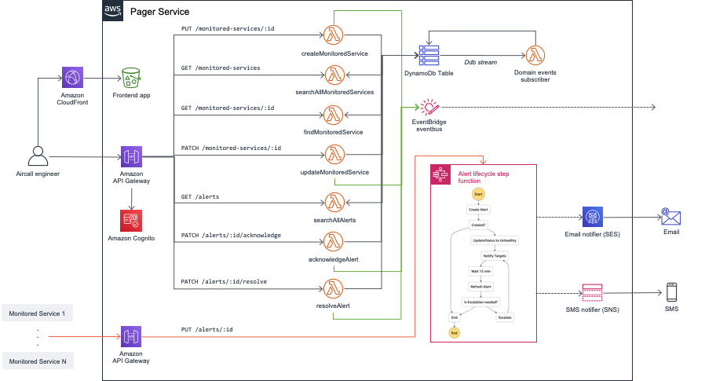

# Alert Notification System

## Prerequisites

Install the following global dependencies:

* [node](https://nodejs.org/en/download/) (v14+)

* [yarn](https://classic.yarnpkg.com/lang/en/docs/install/)

## Getting Started

1. Install dependencies

    ```sh
    yarn
    ```

2. Build `shared` package:

    ```sh
    yarn build
    ```

3. Run unit tests

    ```sh
    yarn test:unit
    ```

    ---
    **NOTE**

    You can also go into the `pager` package at `src/contexts/pager` and run `yarn test:unit` to get the output from jest directly (and run pager's tests only).

    ---

## Overview

This is a working example of the Aircall Pager test. It's been developed following these principles:

* **Event-Driven Architecture**

* **Domain-Driven Design**

* **Hexagonal Architecture**

* **CQRS**

Code is organized as a monorepo (using [**lerna**](https://lerna.js.org/)). This facilitates having each _bounded context_ in its own package while still share code and tooling. There two packages so far: `pager` which contains domain and use cases to manage alerts and monitored services; and `shared` which contains high level abstractions as long as common value objects I believe would be shared among several bounded contexts.

The source tree has been thought as a _screaming architecture_ for the sake of clarify and decoupling. Each package represents either a bounded context or an application of that bounded context in a concrete infrastructure. Bounded contexts are hold in `src/contexts/<context-name>`. Applications would be hold in `src/applications/<context-name>/<app-name>`. For instance, a serverless implementation of the pager would be in `src/applications/pager/serverless/` while a frontend could be in `src/applications/pager/frontend/`.

## AWS infrastructure proposal

A fully serverless implementation is illustrated below. It leverages different AWS services to implement a fully functional pager service.



## Database model proposal

The schema above uses an Amazon DynamoDb table as persistence layer. As part of the exercise, I have designed how data would be stored. I have followed the **single table design**. The design can be found at `docs/pager-dynamodb-design.json`. Just load it in the [DynamoDb Data Modeler](https://rh-web-bucket.s3.amazonaws.com/index.html).